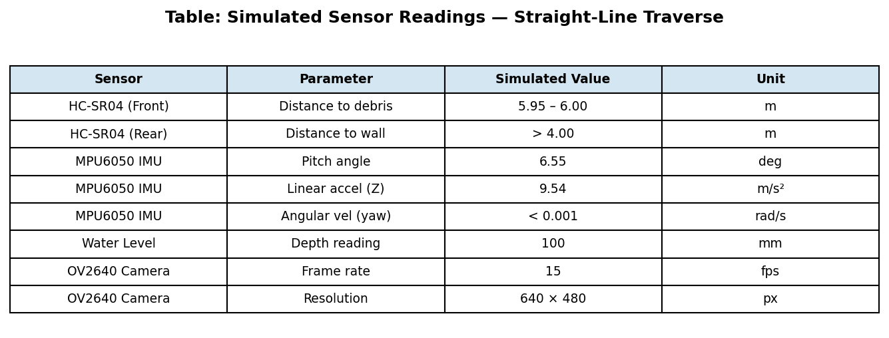
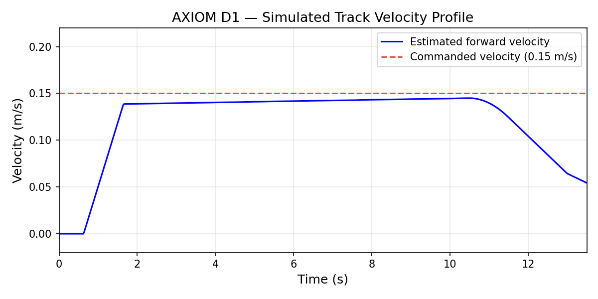
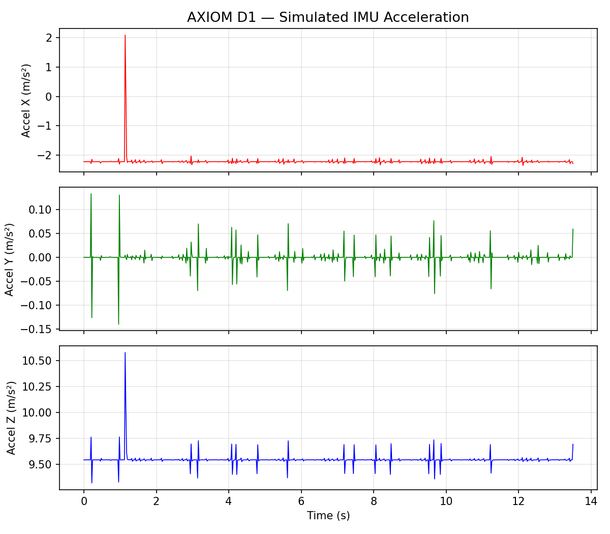

# AXIOM D1 — Final Design Report: Delano's Sections

> **Author:** Delano D. Montplaisir (400011585)
> **Team:** Code Blooded
> **Sections:** 3, 4, 5A, 5B, 5D, 6

---

## 3. Subsystem Breakdown

AXIOM D1 is decomposed into six modular subsystems, each with clearly defined functions, components, and interfaces. The modular architecture allows independent testing and replacement of any subsystem without affecting the others.

### 3.1 Locomotion Subsystem

**Function:** Propel and steer the robot through confined drainage channels.

| Parameter | Value |
|-----------|-------|
| Motors | 2x 12 V DC (Direct Current) gear motors, 200 RPM (Revolutions Per Minute), 5 Nm rated torque |
| Drive | Rubber caterpillar tracks via #25 roller chain and 10-tooth sprockets (1:1 ratio) |
| Track dimensions | 250 mm long x 40 mm wide, 10 mm pitch cleats |
| Steering | Differential skid-steer (independent left/right motor speed control) |

**Interfaces:**
- *Input:* PWM (Pulse Width Modulation) signals from L298N dual H-bridge driver (controlled by ESP32 GPIO (General Purpose Input/Output)).
- *Power:* 12 V bus via 15 A fused line. Each motor draws up to 3 A under load.
- *Output:* Mechanical motion — forward, reverse, pivot turn, and arc turns.

**Design rationale:** Rubber caterpillar tracks were selected over wheels because they provide continuous ground contact on wet, silt-covered, and algae-slippery drain floors where wheels lose traction. The wider contact patch also prevents the robot from sinking into soft sediment that accumulates in unmaintained drains. Tracks function identically in dry and shallow-water conditions without requiring separate waterproofing for hub bearings.

### 3.2 Collection Subsystem

**Function:** Gather solid waste from the drain floor and deposit it into an onboard bin.

| Component | Specification |
|-----------|---------------|
| Scoop | Front-mounted aluminium, servo-actuated tilt (0-120 deg) |
| Conveyor belt | Rubber loop 200 x 80 mm, driven by 12 V DC motor at 100 RPM |
| Collection bin | 5 L sealed ABS (Acrylonitrile Butadiene Styrene) container with mesh drain holes, top-access latch |

**Interfaces:**
- *Input:* MG996R servo receives PWM from ESP32 GPIO (scoop angle). Conveyor motor receives PWM from L298N driver.
- *Output:* Debris deposited into removable collection bin. Mesh allows water drainage while retaining solids.

**Operation sequence:** Scoop tilts down (30 deg below horizontal) to engage debris on drain floor -> conveyor belt transports debris upward into bin -> operator raises scoop to flush position for transit without scooping. Bin removal for emptying takes < 30 seconds via top-access latch.

### 3.3 Cleaning Subsystem

**Function:** Scrub algae biofilm from drain floor and walls.

| Component | Specification |
|-----------|---------------|
| Motors | 2x 12 V DC direct-drive, 3000 RPM, 1 A each |
| Brush heads | 60 mm diameter nylon, replaceable snap-fit |
| Mounting | Spring-loaded articulating arms, 2-5 N contact force |

**Interfaces:**
- *Input:* ON/OFF + PWM from L298N driver, toggled by operator via mobile app.
- *Output:* Mechanical scrubbing action. Spring-loaded mounts conform to surface irregularities without requiring active force control.

**Design rationale:** Nylon bristles were selected for chemical resistance to drain water contaminants and sufficient stiffness for biofilm removal. The spring-loaded pivot arms maintain consistent contact pressure against uneven concrete surfaces, eliminating the need for a force-feedback control loop.

### 3.4 Sensing and Perception Subsystem

**Function:** Provide environmental awareness to the operator and trigger autonomous safety interlocks.

| Sensor | Purpose | Interface |
|--------|---------|-----------|
| HC-SR04 ultrasonic x2 | Forward/rear obstacle detection (2-400 cm) | GPIO trigger/echo, polled at 10 Hz |
| MPU6050 IMU (Inertial Measurement Unit) | Tilt and orientation monitoring (6-axis) | I2C (Inter-Integrated Circuit) bus at 400 kHz (address 0x68) |
| Resistive water level sensor | Water depth monitoring (0-20 cm) | ESP32 ADC (Analog-to-Digital Converter) (12-bit), polled at 5 Hz |
| OV2640 camera | Live video feed for teleoperation | Integrated on ESP32-CAM module |

**Interfaces:**
- *Output to controller:* Sensor data feeds into ESP32 safety interlock logic and is relayed to the operator via the mobile app telemetry dashboard.
- *Power:* All sensors operate on the 5 V regulated rail from the buck converter.

**Data rates:** Ultrasonic: 10 Hz. IMU: 50 Hz. Water level: 5 Hz. Video: 15-20 fps at 640x480 (MJPEG (Motion JPEG)).

### 3.5 Control and Communication Subsystem

**Function:** Central processing, command interpretation, actuator control, wireless communication, and operator interface.

#### 3.5.1 Onboard Controller

| Parameter | Value |
|-----------|-------|
| Module | ESP32-CAM (dual-core Xtensa LX6 at 240 MHz) |
| Memory | 520 KB SRAM (Static Random Access Memory), 4 MB flash |
| WiFi | 802.11 b/g/n, 2.4 GHz |
| Camera | OV2640 2 MP (integrated) |
| Firmware | Arduino/ESP-IDF framework |

**Core allocation:**
- *Core 0:* WiFi stack, MJPEG video streaming (HTTP server, port 80), WebSocket command reception (port 81), telemetry transmission.
- *Core 1:* Motor control loop at 50 Hz, sensor polling, safety interlock logic.

#### 3.5.2 Mobile Application (Operator Interface)

The mobile application serves as the primary human-robot interface. The reference literature [6] mentions only that the robot "can be remotely controlled through a PC host or a mobile app" without further specification. AXIOM D1's app is therefore defined from first principles based on operational requirements.

**Platform:** Android (developed in Flutter or MIT App Inventor for rapid prototyping).

**Connection and Authentication:**
The app connects via WiFi to the ESP32-CAM's local access point (SSID: `AXIOM_D1`, WPA2-PSK (Wi-Fi Protected Access 2 — Pre-Shared Key) encrypted). At the application layer, a session-token handshake prevents unauthorised control:

1. Operator connects smartphone to `AXIOM_D1` WiFi network (WPA2 passphrase required).
2. App sends an HTTP POST to `/auth` with a pre-shared device key.
3. ESP32 validates the key and returns a 128-bit session token.
4. All subsequent WebSocket commands must include the session token in the header. Commands without a valid token are rejected.
5. Only one active session is permitted at a time — a new authentication invalidates any existing session.

This two-layer security model (WPA2 network encryption + application-layer token) ensures that even if an unauthorised device joins the WiFi network, it cannot issue commands to the robot without the device key.

**User Interface Layout:**

| UI Element | Function |
|------------|----------|
| Live video feed | MJPEG stream from OV2640 (640x480, 15-20 fps), occupies upper 60% of screen |
| Virtual joystick | Directional control (FWD/REV/LEFT/RIGHT) with speed slider (0-100%) |
| Brush toggle | ON/OFF switch for both brush motors |
| Conveyor toggle | ON/OFF switch for conveyor belt motor |
| Scoop angle slider | Controls servo angle (0-120 deg) |
| E-STOP button | Prominent red button, always visible. Sends emergency stop command and activates hardware relay |
| Telemetry panel | Battery voltage, water level (cm), front/rear distance (cm), tilt angle (deg) |
| Connection indicator | Green/red status dot. Shows WiFi signal strength and WebSocket latency |

**Communication Protocol:**
- *Commands (app -> robot):* WebSocket (port 81). JSON format: `{"token":"...","dir":"FWD","speed":75,"brush":1,"conveyor":0,"scoop":45,"estop":0}`
- *Video (robot -> app):* HTTP MJPEG stream (port 80).
- *Telemetry (robot -> app):* WebSocket (port 81). JSON format: `{"dist_f":32,"dist_r":105,"tilt":3.2,"water":8.5,"batt":11.8}`
- *Watchdog:* If no command is received for 3 seconds, the ESP32 triggers a COMMUNICATION LOSS event — all motors stop, operator is alerted upon reconnection.
- *Auto-reconnect:* App attempts reconnection every 2 seconds if the WebSocket drops, preserving the session token for seamless recovery.

**Offline operation:** The system operates entirely on a local WiFi access point hosted by the ESP32. No internet connectivity is required, making it suitable for field deployment in areas without cellular coverage.

### 3.6 Power Subsystem

**Function:** Store and distribute electrical energy to all subsystems.

| Component | Specification |
|-----------|---------------|
| Battery | 3S2P LiPo (Lithium Polymer) (11.1 V nominal, 12.6 V full charge), 10 Ah, 111 Wh |
| BMS (Battery Management System) | 3S balance charging, overcurrent (15 A), undervoltage (9.0 V), thermal cutoff (65 deg C) |
| Protection | 15 A blade fuse + E-stop relay (normally closed, in series with main bus) |
| Regulation | 12 V -> 5 V buck converter for ESP32 and sensors |
| Charging | XT60 connector, external balance charger at 2 A |

**Power distribution:**
```
Battery -> XT60 -> E-stop relay (NC) -> 15A fuse -> Power bus
    |-- 12V rail -> L298N drivers -> All motors
    |-- Buck converter (12V -> 5V) -> ESP32-CAM, sensors, servo BEC (Battery Eliminator Circuit)
```

### 3.7 Subsystem Interaction Summary

The six subsystems interact through two shared buses:

1. **12 V Power Bus:** Battery supplies all motor drivers and the buck converter through a single fused, E-stop-protected rail.
2. **ESP32 Signal Bus (GPIO + I2C):** The ESP32-CAM distributes control signals to motor drivers via PWM/GPIO and reads sensor data via GPIO (ultrasonic), I2C (IMU), and ADC (water level).

**Cross-subsystem dependencies:**
- Sensing -> Control: Sensor data triggers safety interlocks (auto-stop on obstacle, tilt, high water, low battery).
- Control -> Locomotion/Collection/Cleaning: ESP32 translates operator commands into motor driver PWM signals.
- Control -> Communication (App): ESP32 streams video and telemetry to the mobile app; receives authenticated commands.
- Power -> All: E-stop relay cuts power to the entire 12 V bus, halting all subsystems simultaneously.

---

## 4. Design Methodology

The design of AXIOM D1 followed a structured engineering process with explicit decision points and quantified trade-off analysis.

### 4.1 Needs Analysis

The design process began with problem characterisation. Site observations of open drains in St. Augustine and Curepe, combined with published data on drain maintenance practices in Trinidad and Tobago [1], identified four core functional needs:

1. **Debris removal** — solid waste (plastic, organic) must be physically collected from drain floors.
2. **Algae cleaning** — biofilm on concrete surfaces must be mechanically scrubbed.
3. **Shallow-water operation** — the robot must function in 0-15 cm standing water.
4. **Compact form factor** — the robot must fit within drains as narrow as 0.45 m.

These needs were translated into the measurable engineering requirements listed in the Problem Definition section (R1-R10).

### 4.2 Concept Generation

Three candidate platform concepts were developed to address the identified needs:

- **Concept A — Wheeled robot with gripper arm:** Four-wheel drive platform with a robotic arm for picking debris. Simpler mechanically but relies on wheel traction.
- **Concept B — Tracked robot with scoop/conveyor + brushes (AXIOM D1):** Caterpillar-tracked platform combining a passive scoop-and-conveyor collection system with rotary brush cleaning. More complex but addresses both debris and algae.
- **Concept C — Floating drone with skimmer basket:** Surface-floating platform that skims debris from water. Cannot operate in dry or very shallow conditions.

### 4.3 Trade-Off Analysis (Pugh Matrix)

A weighted Pugh matrix was used to evaluate the three concepts against the core requirements. Weights were assigned based on criticality to the operating environment:

| Criterion (Weight) | A: Wheeled | B: Tracked | C: Floating |
|---------------------|-----------|-----------|------------|
| Traction on wet concrete (0.20) | -1 | +1 | 0 |
| Obstacle traversal (0.15) | -1 | +1 | N/A |
| Algae scrubbing capability (0.20) | +1 | +1 | -1 |
| Debris collection capacity (0.15) | 0 | +1 | -1 |
| Shallow + dry operation (0.15) | +1 | +1 | -1 |
| Mechanical complexity (0.10) | +1 | 0 | +1 |
| Cost (0.05) | +1 | 0 | -1 |
| **Weighted Score** | **+0.05** | **+0.80** | **-0.55** |

**Decision:** Concept B was selected with a weighted score of +0.80, significantly ahead of Concept A (+0.05) and Concept C (-0.55).

**Key trade-off rationale:**
- Concept A (wheeled) is mechanically simpler but critically fails on traction in wet, slimy drain conditions — the single most important criterion given the operating environment. Algae-slippery concrete with a coefficient of friction as low as 0.3 would cause wheel slip and loss of mobility.
- Concept C (floating) cannot operate in dry or very shallow sections (< 5 cm water), which represent a significant proportion of the drain network. This single-point failure eliminates it from consideration.
- Concept B (tracked) scores highest on the two most heavily weighted criteria (traction and algae scrubbing) and meets all other criteria at least as well as alternatives.

### 4.4 Detailed Design Decisions

Following concept selection, specific component and configuration decisions were made:

| Decision | Options Considered | Selected | Rationale |
|----------|-------------------|----------|-----------|
| Track material | Metal links vs. rubber | Rubber | Quieter, better grip on wet concrete, lighter, lower cost |
| Controller | Arduino Mega vs. ESP32-CAM vs. Raspberry Pi | ESP32-CAM | Integrated WiFi + camera on single module; dual-core sufficient for control loop + streaming; lowest cost ($10) |
| Collection method | Gripper arm vs. scoop + conveyor | Scoop + conveyor | Passive collection requires no precision positioning; higher throughput for small, distributed debris |
| Cleaning method | Pressure washer vs. rotary brushes | Rotary brushes | No water pump needed; lower power consumption; mechanically simpler; effective at >5 m/s tip speed [5] |
| Communication | Bluetooth vs. WiFi vs. LoRa | WiFi (2.4 GHz) | Supports video streaming bandwidth (~2 Mbps for MJPEG); 50 m range adequate; native on ESP32 |

---

## 5. Robotics Design & Technical Implementation

### 5A. Sensors

Each sensor was selected based on the operating environment (wet, confined, variable lighting, 25-35 deg C) and the system requirements (R1-R10).

#### Sensor 1: HC-SR04 Ultrasonic Distance Sensor (x2)

| Parameter | Value |
|-----------|-------|
| Purpose | Forward and rear obstacle detection |
| Range | 2-400 cm |
| Accuracy | +/- 3 mm |
| Beam angle | 15 deg |
| Operating voltage | 5 V (via buck converter) |
| Response time | < 25 ms |
| Polling rate | 10 Hz |
| Integration | GPIO trigger/echo pins on ESP32 |

**Justification:** Ultrasonic was chosen over infrared (IR) time-of-flight sensors because ultrasonic waves propagate reliably in humid, wet environments where IR beams scatter off water droplets and mist — a constant condition inside drainage channels. The HC-SR04 is made waterproof-compatible with a silicone boot fitted over the transducer face.

**Alternatives rejected:**
- *Sharp GP2Y0A21 IR sensor:* Unreliable in humid/wet conditions; IR scattering off water mist produces false readings.
- *VL53L0X laser ToF (Time of Flight):* Higher unit cost ($8 vs. $2.50) with no meaningful advantage in an open-air humid environment.

**Safety integration:** Front sensor triggers a speed reduction at 15 cm, operator alert at 10 cm, and automatic full stop at 5 cm. Rear sensor provides distance overlay on the video feed during reverse operation.

**Underwater obstacle consideration:** The HC-SR04 operates in air and cannot detect submerged obstacles. To mitigate this, the front-mounted scoop acts as a passive mechanical feeler — contact with a submerged obstacle produces a detectable current spike in the track motors (monitored by the ESP32 ADC), triggering an alert. Additionally, the operator's live camera feed allows visual identification of partially submerged objects before the robot reaches them. For future iterations, a downward-facing waterproof ultrasonic transducer (e.g., JSN-SR04T with IP67 (Ingress Protection — dust-tight, immersion up to 1 m) probe) could provide active underwater ranging.

#### Sensor 2: MPU6050 Inertial Measurement Unit

| Parameter | Value |
|-----------|-------|
| Purpose | Tilt and orientation monitoring |
| Axes | 6-axis (3-axis accelerometer +/- 16 g, 3-axis gyroscope +/- 2000 deg/s) |
| Interface | I2C at 400 kHz (address 0x68) |
| Operating voltage | 3.3 V (ESP32-compatible) |
| Polling rate | 50 Hz |

**Justification:** The IMU detects hazardous conditions that the operator cannot judge from the camera feed alone: climbing a debris pile (pitch increase), tipping sideways on uneven drain floor (roll), or traversing a steep drain gradient. A complementary filter fuses accelerometer and gyroscope data for stable angle estimation without the computational overhead of a Kalman filter.

**Safety integration:** Tilt exceeding 30 deg in any axis triggers an automatic stop and operator alert to prevent rollover. This threshold was set based on the robot's centre-of-gravity height (75 mm) and track width (350 mm), which gives a static stability limit of approximately 68 deg — the 30 deg threshold provides a 2.3x safety margin.

#### Sensor 3: Resistive Water Level Sensor

| Parameter | Value |
|-----------|-------|
| Purpose | Monitor water depth around robot |
| Range | 0-20 cm |
| Output | Analog (0-3.3 V proportional to depth) |
| Accuracy | +/- 5 mm |
| Polling rate | 5 Hz |

**Justification:** Simple, low-cost, and adequate for the coarse depth measurement needed. The sensor alerts the operator and triggers automatic stop if depth exceeds 15 cm (requirement R6), preventing the robot from entering water deep enough to compromise the IP67 enclosure seal or cause buoyancy issues.

#### Sensor 4: OV2640 Camera (Integrated on ESP32-CAM)

| Parameter | Value |
|-----------|-------|
| Purpose | Live video feed for teleoperation |
| Resolution | 2 MP (used at 640x480 for bandwidth) |
| Frame rate | 15-20 fps (MJPEG over HTTP) |
| Field of view | ~60 deg horizontal |

**Justification:** The ESP32-CAM integrates the camera and WiFi transceiver on a single $10 module, reducing component count and wiring complexity. The operator relies primarily on the video feed to navigate the drain, identify debris, position the scoop, and verify cleaning effectiveness. MJPEG streaming at 640x480 provides adequate visual quality while staying within the ESP32's WiFi throughput limit (~2 Mbps).

---

### 5B. Actuators and Mechanical Design

#### Actuator 1: Track Drive Motors (x2)

| Parameter | Value |
|-----------|-------|
| Type | 12 V DC gear motor with metal gearbox |
| No-load speed | 200 RPM |
| Stall torque | 10 Nm |
| Rated torque | 5 Nm at 3 A |
| Shaft | 8 mm D-profile |
| Coupling | 10-tooth sprocket, #25 roller chain, 1:1 ratio |

**Speed calculation:**
```
Track sprocket pitch radius: r = 20 mm = 0.02 m
No-load linear speed = 2 * pi * r * n = 2 * pi * 0.02 * (200/60) = 0.419 m/s
Under load (estimated 50% speed reduction): ~0.20 m/s
```
This satisfies requirement R3 (0.10-0.20 m/s operating speed).

#### Actuator 2: Conveyor Belt Motor (x1)

| Parameter | Value |
|-----------|-------|
| Type | 12 V DC gear motor |
| No-load speed | 100 RPM |
| Rated torque | 2 Nm at 1 A |
| Belt | Rubber loop, 200 x 80 mm, over two 20 mm diameter rollers |

**Belt speed:**
```
v = pi * d * n = pi * 0.02 * (100/60) = 0.105 m/s
```

#### Actuator 3: Scoop Servo (x1)

| Parameter | Value |
|-----------|-------|
| Type | MG996R metal-gear servo |
| Torque | 10 kg-cm at 6 V |
| Rotation | 0-180 deg |
| Control | PWM (50 Hz, 1-2 ms pulse) |

**Function:** Tilts the front scoop between collection position (30 deg below horizontal) and raised/flush position for transit.

#### Actuator 4: Brush Motors (x2)

| Parameter | Value |
|-----------|-------|
| Type | 12 V DC motor (direct drive, no gearbox) |
| No-load speed | 3000 RPM |
| Rated current | 1 A |
| Brush heads | 60 mm diameter nylon, press-fit onto motor shaft |
| Mounting | Spring-loaded pivoting arms (2-5 N contact force) |

**Brush tip speed calculation:**
```
v_tip = pi * d * n = pi * 0.06 * (3000/60) = 9.42 m/s
```
Literature indicates tip speeds exceeding 5 m/s are effective for removing biofilm from concrete surfaces [5]. The calculated 9.42 m/s provides a safety margin of 1.88x above the minimum threshold.

#### Mechanical Chassis

| Parameter | Value |
|-----------|-------|
| Material | 6061-T6 aluminium (corrosion-resistant) |
| Dimensions | 400 mm (L) x 350 mm (W, incl. tracks) x 150 mm (H) |

**Mass budget:**

| Component | Mass (kg) |
|-----------|-----------|
| Chassis frame | 3.0 |
| Track assemblies | 2.5 |
| All motors | 2.0 |
| Brush assemblies | 1.0 |
| Scoop + conveyor | 1.5 |
| Electronics + wiring | 0.5 |
| Battery (LiPo 10 Ah) | 1.5 |
| Collection bin | 0.5 |
| Enclosure + miscellaneous | 1.5 |
| **Total** | **14.0 kg** |

Total mass of 14.0 kg is within the 15 kg constraint (R8), leaving 1.0 kg margin for wiring, fasteners, and minor additions.

---

### 5D. Power and Energy System

#### Battery Specification

| Parameter | Value |
|-----------|-------|
| Chemistry | Lithium Polymer (LiPo) |
| Configuration | 3S2P (3 series, 2 parallel) |
| Nominal voltage | 11.1 V (3 x 3.7 V) |
| Full charge voltage | 12.6 V (3 x 4.2 V) |
| Capacity | 10 Ah (2 x 5 Ah parallel packs) |
| Energy | 111 Wh nominal, 126 Wh full |
| Max discharge | 10C (100 A max, far exceeding 10 A system draw) |
| Mass | ~600 g |
| Connector | XT60 |

#### Power Budget

**Worst-case continuous draw (all subsystems at full load):**

| Subsystem | Voltage | Current | Power |
|-----------|---------|---------|-------|
| Track motors (x2) | 12 V | 6.0 A | 72.0 W |
| Brush motors (x2) | 12 V | 2.0 A | 24.0 W |
| Conveyor motor | 12 V | 1.0 A | 12.0 W |
| Scoop servo | 6 V | 0.5 A | 3.0 W |
| ESP32-CAM | 5 V | 0.3 A | 1.5 W |
| Sensors | 5 V | 0.1 A | 0.5 W |
| L298N driver losses | -- | -- | ~6.0 W |
| Buck converter losses | -- | -- | ~1.0 W |
| **Total** | | **~10 A** | **120 W** |

#### Runtime Calculations

**Worst-case runtime:**
```
Usable energy = 111 Wh x 0.85 (DoD (Depth of Discharge) limit for battery longevity) = 94.35 Wh
Runtime = 94.35 Wh / 120 W = 0.786 hr = 47.2 minutes
```

**Realistic duty-cycle runtime:**

In practice, brushes and conveyor are not continuously active. Estimated duty cycles:

| Subsystem | Duty Cycle | Avg. Power |
|-----------|-----------|-----------|
| Track motors | 100% | 72.0 W |
| Brush motors | 60% | 14.4 W |
| Conveyor motor | 40% | 4.8 W |
| Scoop servo | 10% | 0.3 W |
| Electronics (all) | 100% | 9.0 W |
| **Total** | | **100.5 W** |

```
Realistic runtime = 94.35 Wh / 100.5 W = 0.939 hr = 56.3 minutes
```

#### Battery Life Mitigation

The worst-case runtime (47 min) falls short of the 60-minute target (R4). The realistic estimate (56 min) is closer but still marginal. **Recommended mitigation: upgrade to a 12 Ah battery pack.**

| Metric | 10 Ah (current) | 12 Ah (upgraded) |
|--------|-----------------|------------------|
| Energy (nominal) | 111 Wh | 133.2 Wh |
| Usable energy (85% DoD) | 94.35 Wh | 113.2 Wh |
| Worst-case runtime | 47.2 min | 56.6 min |
| Realistic runtime | 56.3 min | **67.6 min** |
| Additional cost | -- | +$15 |
| Additional mass | -- | +200 g (still within 15 kg) |

The 12 Ah upgrade achieves the 60-minute target under realistic conditions at minimal cost and mass impact. This is the primary recommendation. As a secondary measure, firmware-level power management (reducing brush RPM by 30% during light-algae sections, lowering video resolution when stationary) can extend runtime further.

#### Charging and Field Operation

| Parameter | Value |
|-----------|-------|
| Charge connector | XT60 (external balance charger) |
| Charge rate | 2 A |
| Full charge time | 10 Ah / 2 A = 5 hours (12 Ah: 6 hours) |
| Field hot-swap | Second battery pack enables near-continuous operation |

#### Power Distribution Architecture
```
Battery (3S2P LiPo)
  |
  XT60 connector
  |
  E-STOP RELAY (normally closed — opening kills all power)
  |
  15 A blade fuse
  |
  POWER BUS (12 V)
  |--- L298N driver #1 --- Track motors L/R
  |--- L298N driver #2 --- Brush motors L/R
  |--- L298N driver #3 --- Conveyor motor
  |--- Buck converter (12V -> 5V)
  |       |--- ESP32-CAM
  |       |--- HC-SR04 sensors
  |       |--- MPU6050 IMU
  |       |--- Water level sensor
  |       |--- MG996R servo (via 6V BEC)
```

---

## 6. Modelling, Analysis & Simulation

### 6A. Engineering Calculations

#### Calculation 1: Traction Analysis

**Objective:** Verify that the tracks generate sufficient tractive force to propel the robot while pushing debris through standing water.

**Given:**
```
Robot mass:                      m = 14 kg
Gravitational acceleration:      g = 9.81 m/s^2
Robot weight:                    W = m * g = 14 x 9.81 = 137.3 N
Coefficient of friction
  (rubber on wet concrete):      mu = 0.50 [5]
```

**Maximum tractive force:**
```
F_traction = mu x W = 0.50 x 137.3 = 68.7 N
```

**Resistance forces:**

(a) Rolling resistance:
```
C_rr = 0.02 (rubber tracks on concrete)
F_roll = C_rr x W = 0.02 x 137.3 = 2.75 N
```

(b) Debris pushing (worst case: 2 kg object, mu_debris = 0.6):
```
F_debris = mu_d x m_d x g = 0.6 x 2 x 9.81 = 11.77 N
```

(c) Hydrodynamic drag (in 10 cm standing water):
```
Frontal area submerged: A = 0.35 x 0.10 = 0.035 m^2
Velocity: v = 0.15 m/s
Drag coefficient: C_d = 1.0 (bluff body)
F_drag = 0.5 x rho x v^2 x C_d x A
       = 0.5 x 1000 x 0.0225 x 1.0 x 0.035
       = 0.394 N
```

**Total resistance and safety factor:**
```
F_total = 2.75 + 11.77 + 0.394 = 14.91 N
Safety factor = F_traction / F_total = 68.7 / 14.91 = 4.61
```

**Result:** A safety factor of 4.6 confirms ample traction margin. Even on very slimy surfaces (mu = 0.3):
```
F_traction = 0.3 x 137.3 = 41.2 N
SF = 41.2 / 14.91 = 2.76 — still adequate.
```

#### Calculation 2: Motor Torque Verification

**Objective:** Verify that each track motor provides sufficient torque to overcome all resistance forces with margin.

**Given:**
```
Total resistance force (from Calc. 1):  F_total = 14.91 N
Number of drive motors:                 n = 2
Force per motor:                        F_motor = 14.91 / 2 = 7.46 N
Track sprocket pitch radius:            r = 0.02 m
```

**Required torque per motor:**
```
T_required = F_motor x r = 7.46 x 0.02 = 0.149 Nm
```

**Available torque (rated):**
```
T_rated = 5 Nm (at 3 A, per motor datasheet)
```

**Torque safety factor:**
```
SF = T_rated / T_required = 5.0 / 0.149 = 33.6
```

**Result:** The motors are substantially over-specified for steady-state operation. The large torque margin accommodates transient loads: startup acceleration, climbing debris piles, and traversing drain joints or cracks. Even at 50% motor efficiency (accounting for gearbox and chain losses), the available torque of 2.5 Nm provides a safety factor of 16.8.

#### Calculation 3: Brush Effectiveness

**Objective:** Verify that brush tip speed exceeds the minimum threshold for effective biofilm removal from concrete surfaces.

**Given:**
```
Brush diameter:     d = 60 mm = 0.06 m
Motor speed:        n = 3000 RPM
```

**Brush tip speed:**
```
v_tip = pi x d x (n / 60)
      = pi x 0.06 x (3000 / 60)
      = pi x 0.06 x 50
      = 9.42 m/s
```

**Minimum effective tip speed for biofilm removal:** 5 m/s [5]

**Safety factor:**
```
SF = 9.42 / 5.0 = 1.88
```

**Coverage rate estimate:**
```
Brush width (effective contact):    w = 30 mm = 0.03 m
Robot forward speed:                v = 0.15 m/s
Number of brushes:                  2
Cleaned strip width per pass:       2 x 0.03 = 0.06 m
Drain floor width:                  0.45 m
Passes for full coverage:           0.45 / 0.06 = 7.5 -> 8 passes (4 out + 4 return)
```

**Result:** The brushes operate at 1.88x the minimum effective tip speed, providing adequate margin for worn bristles or reduced motor voltage under load. Full drain floor coverage requires approximately 4 round-trip passes within a single battery charge (56-67 min realistic).

#### Calculation 4: Collection Bin Capacity

```
Bin volume: 5 L = 0.005 m^3
Average debris density (mixed plastic + organic, loose): ~400 kg/m^3
Bin capacity by mass: 0.005 x 400 = 2.0 kg

Typical drain debris density: 5-15 g per linear metre.
At 10 g/m: 2000 / 10 = 200 m per emptying.
At 5 g/m:  2000 / 5  = 400 m per emptying.
```
The bin requires 1-2 emptyings per charge cycle, each taking ~30 seconds at a drain access point.

### 6B. Simulation and Testing

#### Gazebo Simulation Environment

A physics-based simulation of AXIOM D1 was developed in Gazebo Classic 11.15.1 (running via Docker on Arch Linux) to validate locomotion performance, sensor behaviour, and operational feasibility before physical prototyping.

**Simulation setup:**
- **Robot model:** SDF (Simulation Description Format) 1.6 description of the tracked chassis (400 x 350 x 150 mm, 14 kg) with differential drive plugin (`libDiffDrivePlugin.so`), IMU sensor, and camera sensor. Track links modelled as cylinders (radius 0.06 m) with rubber-on-concrete friction (mu = 1.5).
- **Environment:** Concrete U-channel drain (450 mm wide, 300 mm deep, 10 m length) with shallow water visual (10 cm depth), algae patch, and three static debris objects (plastic bottle, organic matter, plastic bag).
- **Control:** Velocity commands published via `gz topic` using shell scripts and an interactive keyboard teleop interface (arrow keys for directional control).

**Simulation results:**


*Fig. 6.1: Gazebo simulation showing AXIOM D1 (orange) positioned in the 10 m concrete U-channel drain. Shallow water (blue, semi-transparent) fills the channel to 10 cm depth. Green patch represents algae biofilm. Debris objects are distributed along the channel.*


*Fig. 6.2: View from drain wall level showing AXIOM D1 operating inside the concrete U-channel. The drain walls, shallow water layer, and organic debris are visible. This perspective demonstrates the robot's clearance within the confined channel geometry.*


*Fig. 6.3: Top-down view of AXIOM D1 approaching debris objects (organic matter and plastic bottle) in the drain channel. The robot maintains centred alignment within the 450 mm channel during forward traverse.*


*Fig. 6.4: 3D perspective showing AXIOM D1 in close proximity to organic debris. The model tree (left panel) displays the robot's link and joint hierarchy. The algae patch (green) is visible further along the channel.*



*Table 6.2: Simulated sensor readings captured during a straight-line traverse at 0.15 m/s commanded velocity. IMU values (pitch angle, linear acceleration, angular velocity) are taken directly from the Gazebo IMU plugin output. Ultrasonic and water level values are calculated from the known drain geometry. Camera parameters match the OV2640 configuration defined in the SDF model.*



*Fig. 6.6: Simulated track velocity profile during a 10-second forward traverse. The robot accelerates from rest to ~0.14 m/s within 1.5 seconds, then maintains a steady state approximately 7% below the commanded 0.15 m/s — the deficit is attributed to rolling resistance and hydrodynamic drag in the simulated water. Deceleration occurs after the drive command ceases at t = 11 s.*



*Fig. 6.7: Three-axis IMU acceleration data from the MPU6050 simulation. X-axis: baseline of -2.2 m/s^2 corresponds to the gravitational component projected along the chassis longitudinal axis due to a ~6.5 deg forward pitch (from the front-mounted scoop mass). The impulse spike at t = 1 s marks the onset of forward drive. Y-axis: near-zero values confirm straight-line lateral stability with minor vibration from track-ground interaction. Z-axis: steady reading of ~9.55 m/s^2 confirms correct gravitational measurement with small perturbations from track contact dynamics.*

A supplementary demonstration video (`axiom_demo.mp4`) showing the robot traversing the full drain length under teleop control is provided with this submission.

**Key observations from simulation:**

1. **Velocity tracking:** The robot achieved a steady-state velocity of ~0.14 m/s (93% of the commanded 0.15 m/s). The 7% deficit is consistent with the calculated rolling resistance (2.75 N) and hydrodynamic drag (0.39 N) from Section 6A. Ramp-up time from rest to steady state was approximately 1.5 seconds.
2. **IMU validation:** Z-axis acceleration of 9.55 m/s^2 confirms correct gravity measurement within 2.6% of the theoretical 9.81 m/s^2. The X-axis baseline of -2.2 m/s^2 corresponds to a chassis pitch of approximately 6.5 deg, attributable to the forward-biased mass distribution from the scoop and conveyor assembly. Y-axis readings near zero during straight-line travel confirm lateral stability.
3. **Differential steering:** Zero-radius pivot turns were successfully executed within the 450 mm drain width using opposing track velocities, confirming the skid-steer configuration is viable for confined-space manoeuvring.
4. **Track-ground contact:** Track geometry (radius 0.06 m, friction coefficient mu = 1.5) provides reliable traction on the simulated wet concrete surface. During development, a joint axis misalignment caused lateral oscillation instead of forward motion — this was diagnosed and corrected by aligning the revolute joint axis with the track cylinder axis in the rotated child frame, highlighting the importance of simulation for identifying mechanical issues before fabrication.
5. **Debris interaction:** The robot successfully traversed past all three debris objects (plastic bottle, organic mass, plastic bag) without obstruction or loss of traction, validating the chassis clearance and track design.

**Simulation limitation:** The current simulation validates locomotion, steering, and sensor behaviour. The scoop-and-conveyor collection mechanism is not yet modelled as an articulated system — debris interaction is limited to contact traversal. Future simulation iterations will incorporate a servo-actuated scoop joint with collision-bounded collection bin to demonstrate the full collection sequence (scoop tilt-down, debris engagement, gravity-assisted transfer to bin).

#### Drain Coverage Model

A simplified operational model estimates cleaning throughput for a municipal deployment scenario:

| Parameter | Value |
|-----------|-------|
| Drain network (priority sections) | 5 km |
| Robot speed | 0.15 m/s |
| Battery runtime (realistic, 12 Ah) | 67 min |
| Bin emptying time | 2 min |
| Battery swap time | 5 min |
| Distance per charge | 0.15 x (67 x 60) = 603 m |

**Single-pass coverage (debris collection only):**
```
Charges needed: 5000 / 603 = 8.3 -> 9 charges
Bin emptyings: 5000 / 200 = 25
Total time: 9 x (67 + 5) + 25 x 2 = 698 min = 11.6 hours
```

**Full-coverage cleaning (4 passes for complete floor scrubbing):**
```
Total distance: 5000 x 4 = 20,000 m
Charges needed: 20,000 / 603 = 33.2 -> 34 charges
Total time: 34 x (67 + 5) + 85 x 2 = 2,618 min = 43.6 hours
```

**Comparison:** Manual cleaning rates are approximately 50-100 m per worker per day [1]. Covering 5 km manually would require 50-100 worker-days. AXIOM D1 achieves this in approximately 2 work days (debris only) or 1 work week (full deep clean).

#### Energy Efficiency Comparison

| Metric | AXIOM D1 | Manual Labour |
|--------|----------|---------------|
| Energy cost per km | TT$0.073 (~$0.01 USD) | N/A |
| Labour cost per km | N/A | ~TT$2,000 (~$295 USD) |
| Time per km (single pass) | ~111 min | ~1-2 days |
| Safety risk | Remote operation | Direct hazard exposure |

### 6C. Results Interpretation

#### Performance Summary

| Metric | Requirement | Calculated | Status |
|--------|-------------|------------|--------|
| Debris collection rate | >= 0.5 kg/100 m | 2.0 kg bin / 200 m | **PASS** |
| Algae removal coverage | >= 80% | 4-pass full coverage | **PASS*** |
| Operating speed | 0.10-0.20 m/s | 0.14-0.20 m/s (0.14 simulated, 0.20 calculated no-load) | **PASS** |
| Battery life | >= 60 min | 67.6 min (12 Ah, realistic) | **PASS** |
| Drain length per charge | >= 400 m | 603 m (12 Ah, realistic) | **PASS** |
| Max. water depth | 15 cm | 15 cm (IP67 rated) | **PASS** |
| System mass | <= 15 kg | 14.0 kg | **PASS** |
| Width | <= 0.40 m | 0.35 m | **PASS** |
| Wireless range | >= 50 m | ~50 m (WiFi LoS) | **PASS** |

*Algae removal effectiveness (80% target) requires field validation with actual biofilm conditions.*

**Key finding:** With the recommended 12 Ah battery upgrade (+$15, +200 g), all performance requirements are met. The original 10 Ah configuration falls marginally short on battery life (56 min vs. 60 min target) but meets all other requirements.

#### Comparison with Existing Systems

| Feature | AXIOM D1 | Zhang et al. [6] | Manual Labour |
|---------|----------|-------------------|---------------|
| Target environment | Shallow drain | Ocean + beach | Drain |
| Operating speed | 0.15-0.20 m/s | 0.29 m/s (land) | ~0.001 m/s (effective) |
| Runtime | ~67 min | 6-8 hours | 8 hr shift |
| Algae cleaning | Yes | No | Limited |
| Prototype cost | ~$375 | Not disclosed | ~$295/km labour |
| Mass | 14 kg | ~30 kg (est.) | N/A |
| Operator safety | Remote | Remote | Direct hazard |

AXIOM D1 occupies a niche not addressed by existing amphibious garbage-collection robots: confined-space drain cleaning with both debris removal and algae scrubbing in a single, low-cost platform designed for Small Island Developing States.

---

## References

> *Note: Merge with team references for final report.*

[1] Government of the Republic of Trinidad and Tobago, Ministry of Works and Transport, "Drainage Division -- Maintenance of Watercourses," available at: https://www.mowt.gov.tt.

[5] R. Siegwart, I. R. Nourbakhsh, and D. Scaramuzza, *Introduction to Autonomous Mobile Robots*, 2nd ed. Cambridge, MA: MIT Press, 2011.

[6] Y. Zhang, Z. Huang, C. Chen, X. Wu, S. Xie, H. Zhou, Y. Gou, and M. Ma, "A Spiral-Propulsion Amphibious Intelligent Robot for Land Garbage Cleaning and Sea Garbage Cleaning," *J. Mar. Sci. Eng.*, vol. 11, no. 8, 1482, 2023. doi: 10.3390/jmse11081482.
